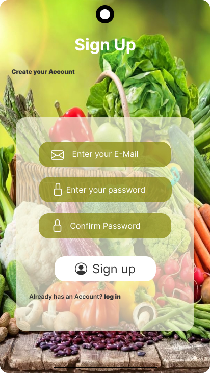
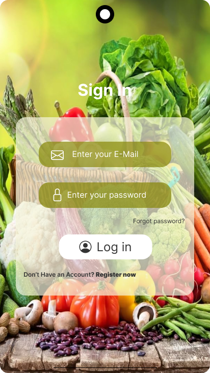
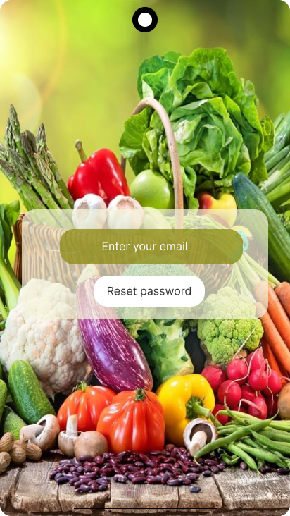
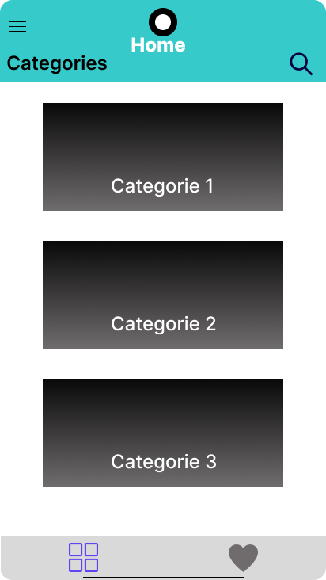
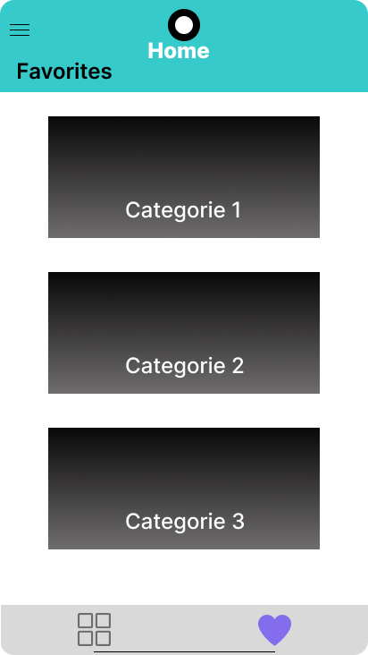
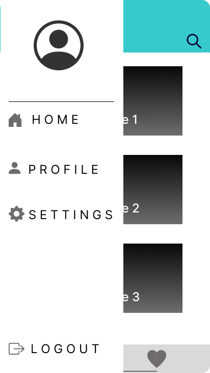

## 👥 Team

- Mohamad Alraghban
- Jafar Alizadeh

---

## Einleitung

### Projektbeschreibung & Ziel des Projekts

**My Recipe** ist eine kostenlose mobile App zur einfachen Suche und Zubereitung internationaler Gerichte.
Nutzer:innen erhalten Zugang zu Rezepten aus der ganzen Welt. Ziel der App ist es, das Finden und Kochen globaler
Gerichte zu vereinfachen – egal ob Anfänger:in oder Hobbykoch/-köchin.

### Installationsanweisung & Test Accounts

#### Voraussetzungen

- Flutter SDK (3.29.2)
- Android Studio Flutter und Dart Plugin

#### Lokale Einrichtung

`git clone https://gitlab.ai.it.hs-worms.de/ema-ss25/team-2.git`  
 `cd my-recipe` 2. Abhängigkeiten installieren:  
 `flutter pub get` 3. Emulator starten oder Gerät anschließen 4. App starten:  
 `flutter run`

#### Test-Accounts (Demo-Zugang)

- NUR IM OFFLINE MODUS

| E-Mail        | Passwort |
| ------------- | -------- |
| test@test.com | 123456   |

- ODER IM ONLINE MODUS

| E-Mail              | Passwort |
|---------------------| -------- |
| inf4365@hs-worms.de | 123456   |

### User Stories

- Als Nutzer:in möchte ich einen Portionsrechner nutzen können,
  damit ich die Zutatenmengen passend kalkulieren und Lebensmittelverschwendung vermeiden kann.
- Als Nutzer:in möchte ich beliebig viele beliebige Gerichte zu meiner Favoritenliste hinzufügen können,
  damit ich meine bevorzugten Gerichte schnell wiederfinden und nicht jedes Mal neu suchen muss.
- Als Nutzer möchte ich verschiedene Essenskategorien durchsuchen können, damit ich Rezepte nach Küchenart oder Gerichtstyp finden kann.
- Als Nutzer möchte ich die Details eines Rezepts (Zutaten, Anweisungen, Beschreibung) sehen können, damit ich das Gericht korrekt zubereiten kann.
- Als Nutzer möchte ich Rezepte als Favoriten markieren können, damit ich schnell wieder darauf zugreifen kann, ohne sie erneut suchen zu müssen.
- Als Nutzer möchte ich nach Rezepten suchen können, damit ich schnell bestimmte Gerichte finde.
- Als Nutzer möchte ich ein Rezept mit anderen teilen können, damit ich es meinen Freunden und meiner Familie empfehlen kann.
- Als Nutzer möchte ich meine Profilinformationen sehen können, damit ich mein Konto verwalten kann.
- Als Koch-Anfänger möchte ich einfache und schnelle Rezepte finden können, damit ich nicht überfordert bin und schnell Erfolge erziele.
- Als Nutzer möchte ich zwischen Hell und Dunkelmodus wechseln können, damit ich die App meinen persönlichen Vorlieben anpassen kann.

### Wireframes (Mock-ups)

## Tools

### Programmiersprache / verwendete Version

- Dart 3.7.2 mit Flutter SDK 3.29.2

### Verwendete dependencies

- equatable: ^2.0.5
- firebase_core: ^2.32.0
- firebase_auth: ^4.16.0
- cloud_firestore: ^4.17.5
- firebase_storage: ^11.6.0
- firebase_crashlytics: ^3.5.7
- firebase_analytics: ^10.8.0
- device_info_plus: ^10.0.0
- shared_preferences: 2.2.1
- collection: ^1.18.0
- connectivity_plus: ^5.0.2
- image_picker: ^1.0.4
- path_provider: ^2.1.2
- cupertino_icons: ^1.0.8
- flutter_bloc: ^9.1.0

### Beschreibung der gesamten Architektur

Die App wurde so aufgebaut, dass sie **übersichtlich, erweiterbar und gut wartbar** ist. Dafür haben wir die sogenannte **"Clean Architecture"** verwendet. Das bedeutet, dass wir den Code in **drei Hauptbereiche** unterteilt haben – jede hat eine bestimmte Aufgabe:

---

#### 1. Daten-Schicht (`data/`)

Diese Schicht kümmert sich um alles, was mit Daten zu tun hat:

- Holt die Daten z.B. aus **Firebase**
- Speichert neue Rezepte oder Benutzerdaten
- Beispiel: `firebase_recipe_repo.dart`

---

#### 2. Logik-Schicht (`domain/`)

Hier liegt die „Kopfarbeit“ der App:

- Regeln, wie z.B. ein Rezept aufgebaut ist
- Was ein Benutzer ist und was ein Rezept können muss
- Diese Schicht weiß **nichts über Flutter oder Firebase**, nur über die Regeln der App

---

#### 3. Anzeige-Schicht (`presentation/`)

Diese Schicht zeigt dem Nutzer die Inhalte – also alles, was du auf dem Bildschirm siehst:

- **Seiten** wie Login, Rezept-Detail, Startseite
- **Wiederverwendbare Elemente** wie Buttons, Felder, Rezeptkarten
- **Zustandsverwaltung** (mit `Cubit`), um z.B. zu speichern, ob jemand eingeloggt ist oder ein Rezept geladen wurde

---

Diese Struktur sorgt dafür, dass man die App **leicht testen, erweitern oder reparieren** kann – ohne dass alles miteinander vermischt ist.

### Zweck des Tests

Dieser Test überprüft, ob der `AuthCubit` korrekt funktioniert, wenn ein Benutzer sich erfolgreich mit E-Mail und Passwort anmeldet. Dabei wird das Verhalten simuliert, ohne eine echte Verbindung zu Firebase herzustellen.

---

#### Vorgehen

- Es wird ein **Mock-Repository** (`MockAuthRepo`) verwendet, um die Methode `loginWithEmailPassword` zu simulieren.
- Der `AuthCubit` wird mit diesem Mock initialisiert.
- Dann wird die `login()`-Methode aufgerufen.
- Es wird erwartet, dass der `AuthCubit` folgende Zustände sendet:
  1. `AuthLoading`: zeigt, dass der Login-Vorgang läuft
  2. `Authenticated`: zeigt, dass der Benutzer erfolgreich eingeloggt wurde

---

### Ausblicke

In zukünftigen Versionen von **My Recipe** sind folgende Erweiterungen geplant:

1. **Besuch und Verfolgung von Nutzerprofilen**  
   Nutzer:innen sollen die Möglichkeit erhalten, Profile anderer Mitglieder zu besuchen und ihnen zu folgen. Dadurch entsteht eine persönlichere und interaktive Community, in der sich Nutzer:innen gegenseitig inspirieren können.

2. **Favorisieren fremder Rezepte**  
   Es wird möglich sein, Rezepte, die von anderen Nutzer:innen erstellt wurden, zur eigenen Favoritenliste hinzuzufügen. So können interessante Gerichte schneller gespeichert und wiedergefunden werden – unabhängig davon, ob man sie selbst erstellt hat oder nicht.

3. **Bilder posten und kommentieren**  
   Um die soziale Interaktion zu fördern, wird eine Funktion entwickelt, mit der Nutzer:innen Bilder ihrer zubereiteten Gerichte posten und andere Beiträge kommentieren können. Das ermöglicht Feedback, Motivation und den Austausch von Kochtipps.
